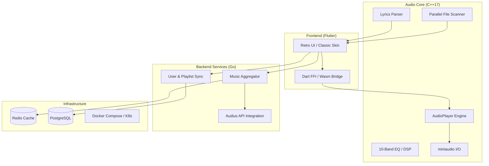

# OmniTune TT Next 🎵

[](https://en.cppreference.com/w/cpp/17)
[](https://flutter.dev)
[](https://golang.org)
[](https://www.docker.com)

**OmniTune TT Next** is a high-performance, cross-platform audio player inspired by the legendary **TTPlayer (千千静听)**. It combines a low-latency C++ core with a retro-styled Flutter UI and a modern Go microservices backend.

It also ships as a **cloud-native web app**: a Next.js + React + TypeScript frontend that runs the *same C++ audio core compiled to WebAssembly*, backed by the Go services on Kubernetes with Redis, PostgreSQL, NATS, MinIO, Prometheus/Grafana, Helm and GitHub Actions CI/CD. See **[`docs/CLOUD_NATIVE.md`](docs/CLOUD_NATIVE.md)**.

> **One command to run the whole platform locally:** `docker compose up -d --build` → web at http://localhost:3000.

---

## 🏛 System Architecture

OmniTune uses a multi-layered architecture to achieve high performance on local playback while supporting cloud synchronization and global streaming.



---

## ✨ Key Features

- **High Fidelity Core:** Low-latency C++17 engine using `miniaudio` for studio-grade playback.
- **Retro Aesthetic:** Pixel-perfect classic skin with LCD-style displays and smooth animations.
- **Classic DSP:** 10-band equalizer (31Hz - 16kHz) for precise audio tailoring.
- **Smart Scanner:** Blazing-fast local library scanning with automatic album art and metadata extraction.
- **Floating Lyrics:** Desktop-overlay "LRC" parser with real-time timestamp synchronization.
- **Cloud Microservices:**
    - **Audius Streaming:** Search and stream millions of tracks via the Audius API.
    - **Cross-Device Sync:** JWT-based auth and PostgreSQL for cloud playlist persistence.
- **Desktop Excellence:** Global hotkeys (Alt+P/S), system tray integration, and native window management.

---

## 🛠 Tech Stack

- **Frontend:** [Flutter](https://flutter.dev) (Desktop/Web/Mobile)
- **Audio Core:** C++17, [miniaudio](https://github.com/mackron/miniaudio)
- **Backend:** [Go](https://golang.org) (Go-kit / Gorilla Mux)
- **Storage:** PostgreSQL (User data), Redis (Cache), SQLite (Local metadata)
- **DevOps:** Docker, Docker Compose, Kubernetes, CMake, Emscripten (Wasm)

---

## 🚀 Getting Started

### Prerequisites
- **C++:** CMake 3.10+, Clang/GCC/MSVC
- **Flutter:** v3.0+
- **Go:** v1.21+
- **Docker:** (Optional, for backend)

### 1. Build the Audio Core (Desktop)
```bash
cmake -S core -B core/build
cmake --build core/build --config Release
```
This produces the native library: `TTPlayerCore.dll` (Windows, under `core/build/Release/`),
`libTTPlayerCore.dylib` (macOS) or `libTTPlayerCore.so` (Linux).

### 2. Run the Frontend
The repo ships with the **macOS** and **web** runners. Generate the others once
(requires the Flutter SDK):
```bash
scripts/setup_platforms.sh             # flutter create for win/mac/linux/ios/android + pub get
```
For mobile (iOS/Android) native-core wiring, see
[`docs/MOBILE_SETUP.md`](docs/MOBILE_SETUP.md) (one Gradle block / one Podfile line).
Then build/run. The Flutter app loads the native core over Dart FFI; the loader
searches next to the executable and common CMake output dirs, so a one-shot
build script keeps the two in sync:
```bash
# Windows (PowerShell): builds the core DLL, builds the app, bundles the DLL
pwsh scripts/build_desktop.ps1

# macOS / Linux
scripts/build_desktop.sh macos
```
For a quick dev run after building the core: `cd app && flutter run -d windows`
(launch from the repo root so the loader finds `core/build/`).

### 3. Deploy Backend (Local)
```bash
docker compose up -d        # aggregator :8000, user-sync :8001, redis, postgres
curl "http://localhost:8000/search?query=test"   # Audius search (Redis-cached)
```
The user-sync service provides real JWT auth (`/auth/register`, `/auth/login`)
and PostgreSQL-backed playlist sync (`/sync/playlist`, `/playlists`).

---

## 🗺 Roadmap

- [x] Phase 1: Platform Setup & FFI/Wasm Bridging.
- [x] Phase 2: Core Engine (Scanner, EQ, Lyrics) & Retro Skin.
- [x] Phase 3: Go Backend, Redis Caching & Docker Orchestration.
- [x] Phase 4: Desktop Features (Hotkeys, Tray) & UI Polish.
- [ ] Phase 5: Mobile Optimization & Multi-platform Release.

> **Implementation status:** see [`docs/IMPLEMENTATION_STATUS.md`](docs/IMPLEMENTATION_STATUS.md)
> for the honest, code-verified state of each feature (the per-task checklists in
> `docs/tasks/` track intended scope, not all of which was wired up originally).

## 📄 License
This project is licensed under the MIT License - see the [LICENSE](LICENSE) file for details.
